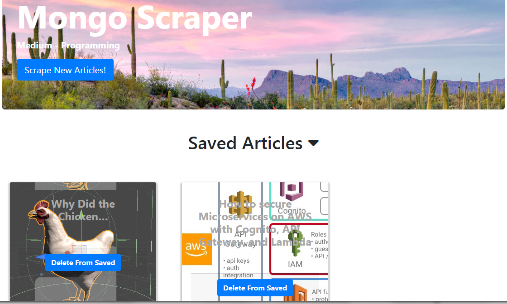

# mongo-scraper
MongoDB Scraper with Mongoose JS

# scrape-the-news

Uses Cheerio to scrape news articles from a site and allows the user to make comments and delete them. Uses Mongoose to store comments and articles.


## Screen Shots


Scraped news articles from The Medium - Programming


Article page to read each article


## Technologies used
- Node.js
- MongoDB - https://www.mongodb.com/download-center#community
- Mongoose - http://mongoosejs.com/docs/
- express NPM Package - https://www.npmjs.com/package/express
- express-handlebars NPM Package - https://www.npmjs.com/package/express-handlebars
- cheerio NPM Package - https://www.npmjs.com/package/cheerio
- body-parser NPM Package - https://www.npmjs.com/package/body-parser
- morgan NPM Package - https://www.npmjs.com/package/morgan
- request NPM Package - https://www.npmjs.com/package/request

### Prerequisites

```
- Node.js - Download the latest version of Node https://nodejs.org/en/

```

## Built With


* Node
* Mongoose/MongoDB
* Robomongo - Download the latest version https://robomongo.org/


